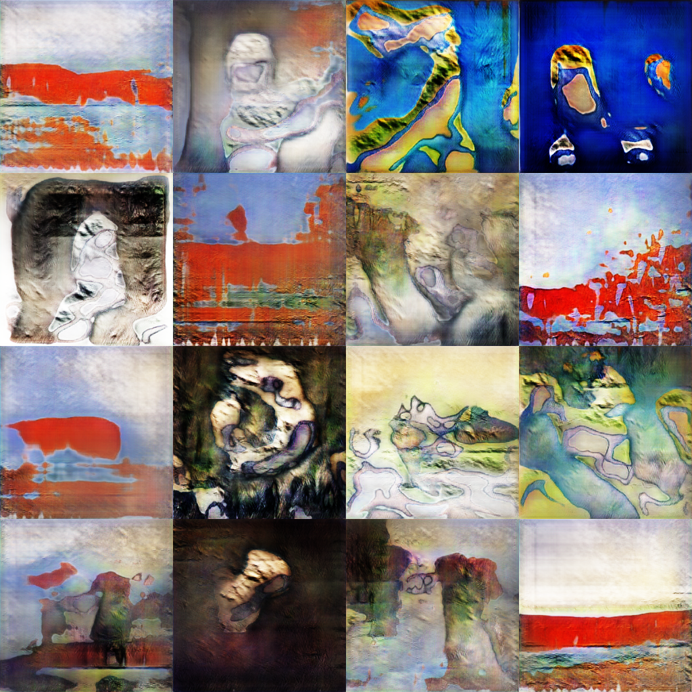

# Creative Adversarial Networks


*256x256 samples directly from CAN (no cherry picking) with fixed classification network trained on WikiArt*


An implementation of [CAN: Creative Adversarial Networks, Generating "Art" 
by Learning About Styles and Deviating from Style Norms](https://arxiv.org/abs/1706.07068) with a variation that improves sample variance and quality significantly.

Repo based on [DCGAN-tensorflow](https://github.com/carpedm20/DCGAN-tensorflow).

<!-- with modifications to reduce checkerboard artifacts according to [this --> 
<!-- distill article](https://distill.pub/2016/deconv-checkerboard/) -->


## Getting the Dataset
We used the [wikiart](https://www.wikiart.org/) dataset 
[available here](https://github.com/cs-chan/ICIP2016-PC/tree/f5d6f6b58a6d8a4bd05aaaedd9688d08c02df8f2/WikiArt%20Dataset). 
Using the dataset is subject to wikiart's [terms of use](https://www.wikiart.org/en/terms-of-use)

```
mkdir data
cd data
wget http://www.cs-chan.com/source/ICIP2017/wikiart.zip
unzip wikiart.zip
```

## Getting pretrained models
We uploaded all of our models to this [google drive folder](https://drive.google.com/open?id=1FNDxvpb_UY5MZ3zBnOOfGDQCXzeE7hbs)

## Training a CAN model from scratch (architecture used in the paper)
```
bash experiments/train_can_paper.sh # must run from the root directory of the project
```
## Evaluating an existing CAN model
```
# make sure that load_dir acts correctly
bash experiments/eval_can_paper.sh
```

# External Style Classification network
We ran an experiment where we trained an inception resnet to classify style (60% accuracy) 
and then used this for the style classification loss, removing the need to learn the layers
in the discriminator. We hold the style classification network constant, so the style distribution
doesn't change as the generator improves. We found that this improved the quality and diversity
of our samples.

## Training CAN with External Style Network
```
# make sure that `style_net_checkpoint` is set correctly, or you will error out
bash experiment/train_can_external_style.sh
```

## Training the (ImageNet pre-trained) Inception Resnet
Everything you need should be included in the script. The gist is that it converts the wikiart images into tf records
trains the last layer of the model on these images, then fine-tunes the entire model for 100 epochs, at the end of which
you should get roughlyy 60% validation accuracy. Since we're looking to generate artwork, this gives us a
level of accuracy that is sufficient to try and generate new artwork.
```
cd slim/
vim finetune_inception_resnet_v2_on_wikiart.sh # edit INPUT_DATASET_DIR to match the location of where you downloaded wikiart
bash finetune_inception_resnet_v2_on_wikiart.sh
```
## Evaluating CAN with External Style Network
```
# make sure that `style_net_checkpoint` and `load_dir` point to the downloaded models. 
bash eval_can_external_style.sh
```

## Experiments
We have run a variety of experiments, all of which are available in the `experiments/` directory.
## Authors 
[Phillip Kravtsov](https://github.com/phillip-kravtsov)

[Phillip Kuznetsov](https://github.com/philkuz)

## Citation

If you use this implementation in your own work please cite the following
```
@misc{2017cans,
  author = {Phillip Kravtsov and Phillip Kuznetsov},
  title = {Creative Adversarial Networks},
  year = {2017},
  howpublished = {\url{https://github.com/mlberkeley/Creative-Adversarial-Networks}},
  note = {commit xxxxxxx}
}
```
